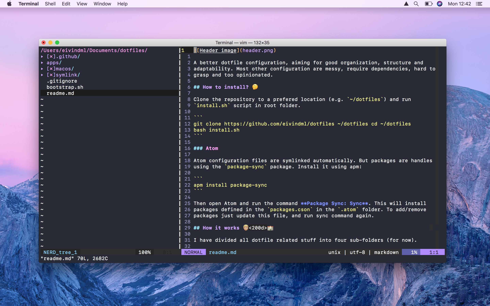

# dotfiles

A better dotfile configuration, aiming for good organization, structure and
adaptability. Most other configuration are messy, require dependencies, hard to
grasp and too opinionated.

## How to install? 🤔

Clone the repository to a prefered location (e.g. `~/dotfiles`) and run
`install.sh` script in root folder.

``` 
git clone https://github.com/eivindml/dotfiles ~/dotfiles cd ~/dotfiles
bash install.sh 
```

## How it works 👨

I have divided all dotfile related stuff into four sub-folders (for now).

``` 
.  
├── apps 
├── macos 
├── symlink 
└── bootstrap.sh 
```

- **app/** is responsible for installing all global apps/software/utilities. E.g. through brew, cask, mas, npm, gem.
- **symlink/** is for all files which belongs to `$HOME` dir and other config files. Typically symlinked files/folders.
- **macos/** is for os configuration. Ideally all settings changes to the os  should be defined here, so that everything can be set back to normal after a reinstall with one command.

Each folder have a file named `_install.sh`, which are responsible for
configuring/installing the content inside itself. 

This way everything is super modular, and the setup won't get entagled with
dependencies etc. Everything can also be removed skipped the setup with by just
commenting one line.

All apps are defined in the files `Brewfile`, `Caskfile`, `Masfile` (Apple
Store apps), `Gemfile` and `Npmfile` (node package).

`install.sh` will run each `_install.sh` defined in all subfolders, while
`update.sh` will run updates for macos and all installed package managers.

## How it looks



## Contributions

I want to keep this modular, clean and organized, without dependencies. If you
have any ideas for improvements, I would love to hear it, either through a pull
request or through an issue.

