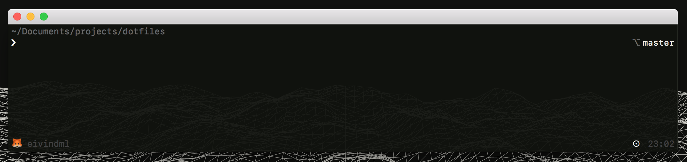

<center></center>

The aim is to create a dotfile setup that configures my entire macOS system.

```
.
├── README.md
├── app
├── bin
│   └── func
├── config
├── home
├── install.sh
└── macos
```

## How?
- Changes macOS settings through defaults writes.
- Symlinks .dotfiles to ~.
- Installs nececary binaries through brew and node/npm.
- Installs .app applications through brew cask.
- Update entire system through `update.sh`.

### Atom
Package List
You use the following:

`apm list --installed --bare > package-list.txt`
to create your package list and then apm install --packages-file package-list.txt to install them.

## Next

- TODO: Clean up project directory and file name and file structure.
