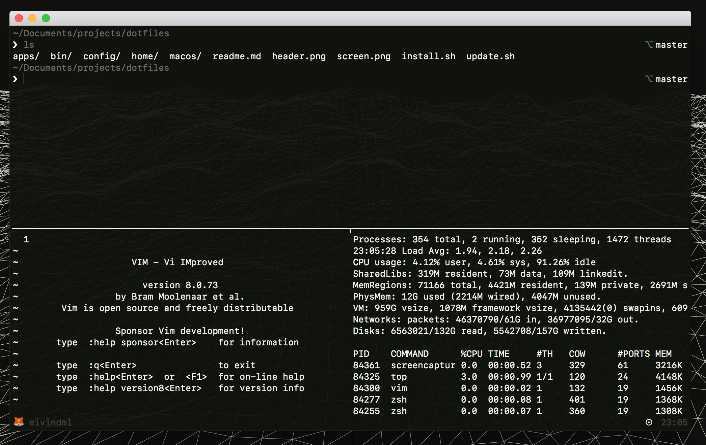

A better dotfile configuration, aiming for good organization, structure and adaptability. Most other configuration are messy, require dependencies, hard to grasp and too opinionated.

## How to install? 🤔

Clone the repository to a prefered location (e.g. `~/dotfiles`) and run `install.sh` script in root folder.

```
git clone https://github.com/eivindml/dotfiles ~/dotfiles
cd ~/dotfiles
bash install.sh
```

### Atom

Atom configuration files are symlinked automatically. But packages are handles using the `package-sync` package. Install it using apm:

```
apm install package-sync
```

Then open Atom and run the command **Package Sync: Sync**. This will install packages defined in the `packages.cson` in the `.atom` folder. To add/remove packages just update this file, and run sync command again.

## How it works 👨🏼‍🏫

I have divided all dotfile related stuff into four sub-folders (for now).

```
.
├── bin
├── apps
├── home
├── macos
├── config
├── update.sh
└── install.sh
```

- **bin/** for executables and scripts. To be added to `$PATH`.
- **app/** is responsible for installing all global apps/software/utilities. E.g. through brew, cask, mas, npm, gem.
- **home/** is for all files which belongs to `$HOME` dir. Typically symlinked files/folders.
- **macos/** is for os configuration. Ideally all settings changes to the os should be defined here, so that everything can be set back to normal after a reinstall with one command.
- **config/** handles other configuration files which are handy to store in a dotfile config. E.g. apache config files.

Each folder have a file named `_install.sh`, which are responsible for configuring/installing the content inside itself. This setup can be nested further down. For instance `apps/` has a `_install.sh`, with subfolders (e.g. `homebrew/`) who also has it's own `_install.sh` file that takes care of itself.

This way everything is super modular, and the setup won't get entagled with dependencies etc. Everything can also be removed skipped the setup with by just commenting one line.

All apps are defined in the files `Brewfile`, `Caskfile`, `Masfile` (Apple Store apps), `Gemfile` and `Npmfile` (node package).

`install.sh` will run each `_install.sh` defined in all subfolders, while `update.sh` will run updates for macos and all installed package managers.

## How it looks



## Contributions

I want to keep this modular, clean and organized, without dependencies. If you have any ideas for improvements, I would love to hear it, either through a pull request or through an issue.
